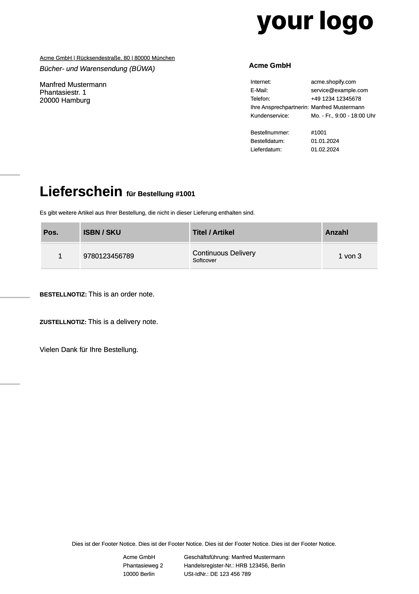

# din-5008-shopify-liquid

## About

This is a repository of [DIN-5008](https://de.wikipedia.org/wiki/DIN_5008) conformant [liquid templates](https://shopify.dev/docs/api/liquid) for [Shopify](https://shopify.dev/docs).

_"Lol, why?"_

Because in Germany we have envelopes with little windows in them, and you need the shipping address to be in the right place for it to be visible in that window. And being DIN-5008 conformant ensures that. True story.

So far, there is the [packing slip](https://help.shopify.com/en/manual/shipping/setting-up-and-managing-your-shipping/packing-slips-variable-list). It looks like this:

## Caveats

The packing slip liquid works for orders/fulfillments that are not longer than a DIN-A4 page. If you have more items, leading to the content breaking to a second page, you need to adjust this template, otherwise things will break. Removing the height on the `.din-5008` class and then fixing things up probably will be enough. But our current use case doesn't require this, so we didn't bother. If you fix this, please submit a PR.

## Acknowledgements

Thank you, @xiphe, [who's work](https://github.com/Xiphe/din-5008-css/tree/master) this is based on.
